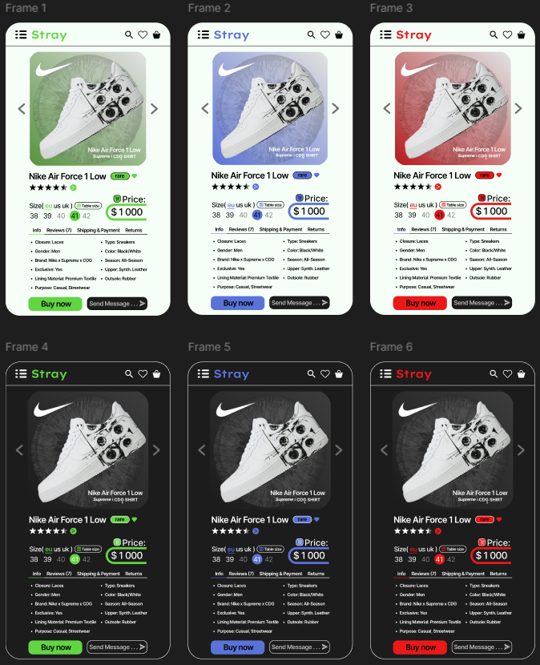

# ПЗ-9: Створення малої картки товару з використанням Auto layout у Figma

## Опанування інструментів  
У цій роботі ми навчимося створювати компактні картки товару у **Figma**, використовуючи функцію **Auto layout**, а також додавати зображення, текстові блоки та значки для візуального оформлення елементів UI.

### Завдання  
- Опанувати функцію **Auto layout** у Figma.  
- Створити **малу картку товару( я створив 6 )**, по три для **світлої** та **темної теми**.
- Для кожної теми використовував кольорові акценти: **синій**, **зелений** та **червоний**.
- Використати відповідні зображення, текст та значки.
- Кожна картка повинна бути зібрана за допомогою **вкладених Auto layout** (всередині основного Auto layout).

### Використані плагіни та ресурси

**Плагіни Figma:**
- **Unsplash** — імпорт зображень різних категорій.  
- **Feather Icons**, **iconsax** — імпорт більш ніж 6000+ значків.  
- **Remove BG** — автоматичне видалення фону зображень *(потрібен акаунт на remove.bg)*.

**Сайти з безкоштовними зображеннями:**
- [Freepik](https://www.freepik.com/home)  
- [Pixabay](https://pixabay.com)  
- [Dribbble](https://dribbble.com)

**Сайти з безкоштовними значками:**
- [Google Fonts Icons](https://fonts.google.com/icons)  
- [Flaticon](https://www.flaticon.com)  
- [IconArchive](https://iconarchive.com)  
- [Iconfinder](https://www.iconfinder.com/free-icons)  
- [Iconmonstr](https://iconmonstr.com)

### Результати

#### Світла тема
<table align="center">
  <tr>
    <td align="center">Картка 1 (синя)</td>
    <td align="center">Картка 2 (зелена)</td>
    <td align="center">Картка 3 (червона)</td>
  </tr>
  <tr>
    <td></td>
    <td></td>
    <td></td>
  </tr>
</table>

#### Темна тема
<table align="center">
  <tr>
    <td align="center">Картка 4 (синя)</td>
    <td align="center">Картка 5 (зелена)</td>
    <td align="center">Картка 6 (червона)</td>
  </tr>
  <tr>
    <td></td>
    <td></td>
    <td></td>
  </tr>
</table>

### Процес створення  
1. Використання **Auto layout** для структурування картки.  
2. Створення **вкладених Auto layout** для елементів всередині основного контейнера.  
3. Додавання зображення товару через плагін **Unsplash** або інші ресурси.  
4. Додавання назви товару, опису та цінової інформації.  
5. Використання значків через плагіни **Feather Icons**, **iconsax** або сторонні ресурси.  
6. Створення варіацій кольорів для світлої та темної тем.

### Робочий процес

  

### Висновок  
У ході виконання завдання було опановано принципи роботи з **Auto layout** у Figma, включаючи створення **вкладених структур** для гнучкого компонування елементів. Створення карток товару дозволило поглибити навички роботи з ієрархією, адаптивністю та візуальним оформленням у Figma. Отримані знання стануть у нагоді при розробці інтерфейсів для проєктів.

### Посилання на проект у Figma  
[Переглянути проект](https://www.figma.com/design/Sm0YeytiSQsMaVDvzk73om/07.04.2025.-1-?node-id=0-1&p=f&t=enlxuZccsjvk43tL-0)  
